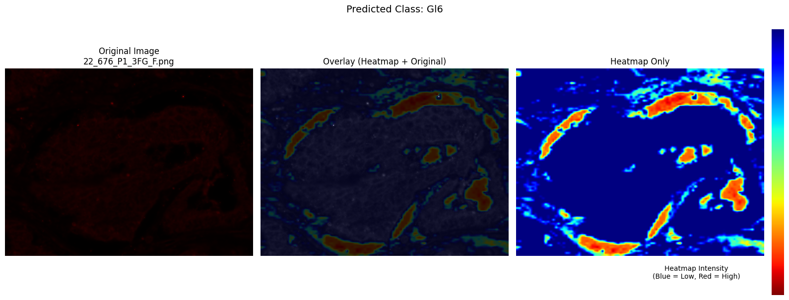

# PyTorch Lightning Image Classifiers

This repository contains modular PyTorch Lightning implementations of popular deep learning models for image classification. All models inherit from a common `BaseClassifier` class, making it easy to modify, extend, and use for various tasks.

## Currently Supported Classifiers

| Model            | Train | Test | Inference | GRAD-CAM |
|------------------|-------|------|-----------|----------|
| SwinTransformer  | ✅    | ✅   | ✅        | ✅       |
| ResNet           | ✅    | ✅   | ✅        | ❌       |
| ResNext          | ✅    | ✅   | ✅        | ❌       |
| DenseNet         | ✅    | ✅   | ✅        | ❌       |
| EfficientNet     | ✅    | ✅   | ✅        | ❌       |
| ViT              | ✅    | ✅   | ✅        | ❌       |

## Features

- **Modular Design**: All models inherit from `BaseClassifier`, ensuring consistent training, validation, and testing workflows.
- **Easy Configuration**: Modify hyperparameters like learning rate, batch size, and optimizer directly in the configuration.
- **Checkpointing**: Automatically saves the best model during training.
- **Early Stopping**: Prevents overfitting by stopping training if validation performance plateaus.

## Usage

1. **Install Dependencies**:
```bash
pip install pytorch_lightning torchvision transformers efficientnet-pytorch
```

2. **Benchmarking Models**:
Use the `train_all_models.py` script to train and test all models and check what works the best.:

After completion, you will get report in csv as below.
Based on the metric, decide which model is appropriate for your task.

| Model            | Test Accuracy   | Test Precision  | Test Recall     | Test F1         | Training Time  | Timestamp      |
|------------------|-----------------|-----------------|-----------------|-----------------|----------------|----------------|
| ResNext101       | 0.78899         | 0.79964         | 0.78899         | 0.78879         | 1:47:51.260405 | 20250221_094927 |
| ResNet101        | 0.78899         | 0.79463         | 0.78899         | 0.78770         | 1:03:14.367643 | 20250221_113730 |
| SwinTransformer  | 0.88073         | 0.88272         | 0.88073         | 0.88030         | 0:22:18.137873 | 20250221_124052 |
| ViT              | 0.84404         | 0.84723         | 0.84404         | 0.84415         | 0:22:27.548590 | 20250221_130314 |
| DenseNet121      | 0.85321         | 0.86235         | 0.85321         | 0.85291         | 0:58:01.608439 | 20250221_132545 |
| EfficientNetB7   | 0.84404         | 0.85011         | 0.84404         | 0.84465         | 3:06:57.563459 | 20250221_142354 |

3. **Train, Test and Inference demo**
Use the `demo.ipynb` to follow the whole workflow with a model architecture.

4. **GRAD-CAM Visualization**

The [grad_cam.ipynb](grad_cam.ipynb) notebook provides a detailed workflow for generating Grad-CAM (Gradient-weighted Class Activation Mapping) heatmaps to visualize which regions of an image are most influential for the model's predictions.



## Extending the Repository:
**To add a new model**:
- Create a new Python file under `models` directory. (e.g., new_model_classifier.py).
- Inherit from BaseClassifier and implement the model-specific logic.
- If needed, Add the new model to the `models_to_test` dictionary in [train_all_models.py](train_all_models.py).

## License
This project is licensed under the MIT License. See [LICENSE](LICENSE) for details.
